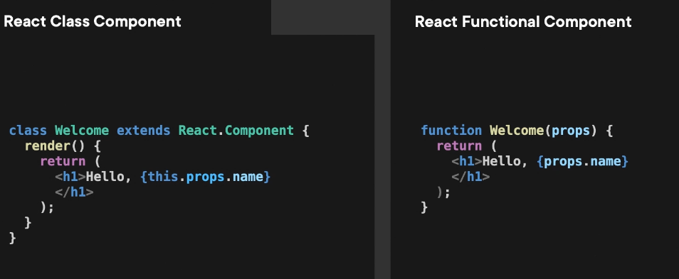
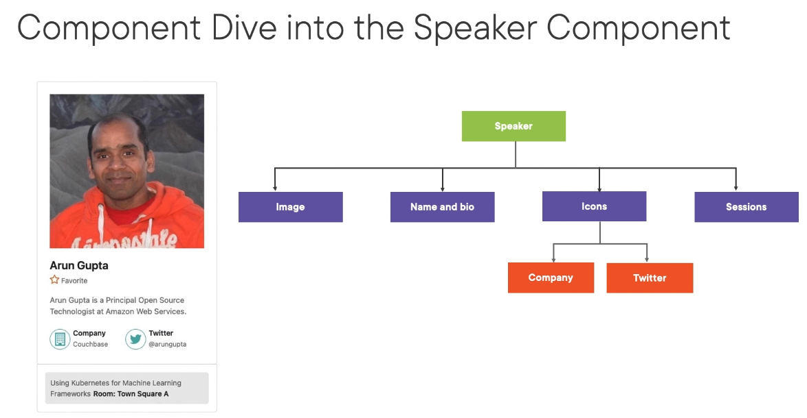

# React Components

Component design is critically important for delivering both a great user experience to our browser users, as well as an equally great experience when developing the app.

# What is a React Component?

Components are building blocks that when combined together make the UI, or user interface, where each component can be thought of as an independent, reasonable part of that UI. The idea being that you can think and program each component completely on its own, which contributes to our goal of making building components easy, as well as brings a great experience to our users.

React apps are just collections of components that render their output based on passed in properties and state data changes.

# Class component or Function Component





## Key attribute

As we are now rendering a list instead of a single item, it's important that we add the key attribute to each item. The value we assign to that key should be a stable value that uniquely identifies the item, speaker in our case, so that the react rendering engine can consistently identify that item if its render value changes. That is, if the speaker is updated, its order in the list changes or it's removed. Because of this, it's important to not simply use the index of the mapping function for this value.

We need the key attribute as the first element in any kind of iterated list. That way, React can keep track of each individual speaker instance so it can react to state changes and render properly.

## Passing props to component in different techniques

**Way 1**

```javascript
function Session({ title, room }) {
  return (
    <span className="session w-100">
      {title} <strong>Room: {room}</strong>
    </span>
  );
}

function Sessions({ sessions }) {
  return (
    <div className="sessionBox card h-250">
      <Session title={sessions[0].title} room={sessions[0].room.name} />
    </div>
  );
}
```

**Way 2**

```javascript
function Session({ session }) {
  const { title, room } = session;
  return (
    <span className="session w-100">
      {title} <strong>Room: {room.name}</strong>
    </span>
  );
}

function Sessions({ sessions }) {
  return (
    <div className="sessionBox card h-250">
      <Session session={sessions[0]} />
    </div>
  );
}
```

**Way 3 : Nested Destructuring**

```javascript
function Session({
  session: {
    title,
    room: { name: room },
  },
}) {
  return (
    <span className="session w-100">
      {title} <strong>Room: {room}</strong>
    </span>
  );
}

function Sessions({ sessions }) {
  return (
    <div className="sessionBox card h-250">
      <Session session={sessions[0]} />
    </div>
  );
}
```

**Way 4**

```javascript
function Session({ title, room }) {
  return (
    <span className="session w-100">
      {title} <strong>Room: {room.name}</strong>
    </span>
  );
}

function Sessions({ sessions }) {
  return (
    <div className="sessionBox card h-250">
      <Session {...sessions[0]} />
    </div>
  );
}
```

## Working on onFavoriteToggle

We want to change the state value which is present at the top most component i.e.,

We want to change that state value so we need to send a function back up our component hierarchy that, when called from this click event, updates our state, or, in this case, we want to update our SpeakerFavorite value stored in state. Let's create a click handler associated with a span enclosing the icon and assign it to this imaginary function, onFavoriteToggle. Then, assume this function is passed in as a receiving prop to us here in this component. Next, let's add it to the components one at a time going up in our component hierarchy until we get to where our speaker's data state is instantiated and we have access to the setSpeakersData function. This is what we mean when we say state goes up. It's really the function that goes up. And when our component here calls that function, the state gets updated. Moving up a level in our hierarchy, that's the component SpeakerDemographics, from where SpeakerFavorite is called, add an attribute, and again assign it to onFavoriteToggle, and again make it an incoming prop to this component. Up once again, this time to the Speaker component itself, add the attribute like before, again, add it as a receiving prop, and we're done with all the components in the speaker.js file.

## Working om ambigous problem such as Error handling and Loading

**Before**

```javascript

// useRequestSpeakers.js file

import { useEffect, useState } from "react";
import { data } from "../../SpeakerData";

function useRequestSpeakers(delayTime = 1000) {
  const [speakersData, setSpeakersData] = useState([]);
  const [isLoading, setIsLoading] = useState(true);
  const [hasErrored, setHasErrored] = useState(false);
  const [error, setError] = useState("");

  const delay = (ms) => new Promise((resolve) => setTimeout(resolve, ms));

  useEffect(() => {
    (async () => {
      try {
        await delay(delayTime);
        // throw "Had error";
        setIsLoading(false);
        setSpeakersData(data);
      } catch (e) {
        setIsLoading(false);
        setHasErrored(true);
        setError(e);
      }
    })();
  }, []);

  function onFavoriteToggle(id) {
    const speakersRecPrevious = speakersData.find((rec) => rec.id === id);
    const speakersRecUpdated = {
      ...speakersRecPrevious,
      favorite: !speakersRecPrevious.favorite,
    };
    const speakersDataNew = speakersData.map((rec) =>
      rec.id === id ? speakersRecUpdated : rec
    );
    setSpeakersData(speakersDataNew);
  }

  return { speakersData, onFavoriteToggle, hasErrored, error, isLoading };
}

export default useRequestSpeakers;

// SpeakersList.js file

import Speaker from "./Speaker";
import ReactPlaceholder from "react-placeholder";
import useRequestSpeakers from "../hooks/useRequestSpeakers";

function SpeakersList({ showSessions }) {
  const { speakersData, onFavoriteToggle, hasErrored, error, isLoading } =
    useRequestSpeakers(2000);

  if (hasErrored === true) {
    return (
      <div className="text-danger">
        ERROR: <b>Loading Speaker data failed: {error}</b>
      </div>
    );
  }

  // if (isLoading === true) return <div>Loading...</div>;

  return (
    <div className="container speakers-list">
      <ReactPlaceholder
        type="media"
        rows={15}
        className="speakerslist-placeholder"
        ready={isLoading === false}
      >
        <div className="row">
          {speakersData.map((speaker) => {
            return (
              <Speaker
                key={speaker.id}
                speaker={speaker}
                showSessions={showSessions}
                onFavoriteToggle={() => {
                  onFavoriteToggle(speaker.id);
                }}
              />
            );
          })}
        </div>
      </ReactPlaceholder>
    </div>
  );
}

export default SpeakersList;
```

**After Refactoring**

```javascript
// SpeakersList.js file

import Speaker from "./Speaker";
import ReactPlaceholder from "react-placeholder";
import useRequestSpeakers, {
  REQUEST_STATUS,
} from "../hooks/useRequestSpeakers";

function SpeakersList({ showSessions }) {
  const { speakersData, onFavoriteToggle, requestStatus, error } =
    useRequestSpeakers(2000);

  if (requestStatus === REQUEST_STATUS.FAILURE) {
    return (
      <div className="text-danger">
        ERROR: <b>Loading Speaker data failed: {error}</b>
      </div>
    );
  }

  // if (isLoading === true) return <div>Loading...</div>;

  return (
    <div className="container speakers-list">
      <ReactPlaceholder
        type="media"
        rows={15}
        className="speakerslist-placeholder"
        ready={requestStatus === REQUEST_STATUS.SUCCESS}
      >
        <div className="row">
          {speakersData.map((speaker) => {
            return (
              <Speaker
                key={speaker.id}
                speaker={speaker}
                showSessions={showSessions}
                onFavoriteToggle={() => {
                  onFavoriteToggle(speaker.id);
                }}
              />
            );
          })}
        </div>
      </ReactPlaceholder>
    </div>
  );
}

export default SpeakersList;

// useRequestSpeakers.js file

import { useEffect, useState } from "react";
import { data } from "../../SpeakerData";

export const REQUEST_STATUS = {
  SUCCESS: "success",
  LOADING: "loading",
  FAILURE: "failure",
};

function useRequestSpeakers(delayTime = 1000) {
  const [speakersData, setSpeakersData] = useState([]);
  const [requestStatus, setRequestStatus] = useState(REQUEST_STATUS.LOADING);
  const [error, setError] = useState("");

  const delay = (ms) => new Promise((resolve) => setTimeout(resolve, ms));

  useEffect(() => {
    (async () => {
      try {
        await delay(delayTime);
        // throw "Had error";
        setRequestStatus(REQUEST_STATUS.SUCCESS);
        setSpeakersData(data);
      } catch (e) {
        setRequestStatus(REQUEST_STATUS.FAILURE);
        setError(e);
      }
    })();
  }, []);

  function onFavoriteToggle(id) {
    const speakersRecPrevious = speakersData.find((rec) => rec.id === id);
    const speakersRecUpdated = {
      ...speakersRecPrevious,
      favorite: !speakersRecPrevious.favorite,
    };
    const speakersDataNew = speakersData.map((rec) =>
      rec.id === id ? speakersRecUpdated : rec
    );
    setSpeakersData(speakersDataNew);
  }

  return { speakersData, onFavoriteToggle, requestStatus, error };
}

export default useRequestSpeakers;
```
