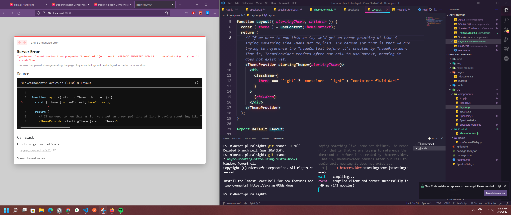

# React Components

Component design is critically important for delivering both a great user experience to our browser users, as well as an equally great experience when developing the app.

# What is a React Component?

Components are building blocks that when combined together make the UI, or user interface, where each component can be thought of as an independent, reasonable part of that UI. The idea being that you can think and program each component completely on its own, which contributes to our goal of making building components easy, as well as brings a great experience to our users.

React apps are just collections of components that render their output based on passed in properties and state data changes.

# Class component or Function Component


## Key attribute

As we are now rendering a list instead of a single item, it's important that we add the key attribute to each item. The value we assign to that key should be a stable value that uniquely identifies the item, speaker in our case, so that the react rendering engine can consistently identify that item if its render value changes. That is, if the speaker is updated, its order in the list changes or it's removed. Because of this, it's important to not simply use the index of the mapping function for this value.

We need the key attribute as the first element in any kind of iterated list. That way, React can keep track of each individual speaker instance so it can react to state changes and render properly.

## Passing props to component in different techniques

**Way 1**

```javascript
function Session({ title, room }) {
  return (
    <span className="session w-100">
      {title} <strong>Room: {room}</strong>
    </span>
  );
}

function Sessions({ sessions }) {
  return (
    <div className="sessionBox card h-250">
      <Session title={sessions[0].title} room={sessions[0].room.name} />
    </div>
  );
}
```

**Way 2**

```javascript
function Session({ session }) {
  const { title, room } = session;
  return (
    <span className="session w-100">
      {title} <strong>Room: {room.name}</strong>
    </span>
  );
}

function Sessions({ sessions }) {
  return (
    <div className="sessionBox card h-250">
      <Session session={sessions[0]} />
    </div>
  );
}
```

**Way 3 : Nested Destructuring**

```javascript
function Session({
  session: {
    title,
    room: { name: room },
  },
}) {
  return (
    <span className="session w-100">
      {title} <strong>Room: {room}</strong>
    </span>
  );
}

function Sessions({ sessions }) {
  return (
    <div className="sessionBox card h-250">
      <Session session={sessions[0]} />
    </div>
  );
}
```

**Way 4**

```javascript
function Session({ title, room }) {
  return (
    <span className="session w-100">
      {title} <strong>Room: {room.name}</strong>
    </span>
  );
}

function Sessions({ sessions }) {
  return (
    <div className="sessionBox card h-250">
      <Session {...sessions[0]} />
    </div>
  );
}
```

## Working on onFavoriteToggle

We want to change the state value which is present at the top most component i.e.,

We want to change that state value so we need to send a function back up our component hierarchy that, when called from this click event, updates our state, or, in this case, we want to update our SpeakerFavorite value stored in state. Let's create a click handler associated with a span enclosing the icon and assign it to this imaginary function, onFavoriteToggle. Then, assume this function is passed in as a receiving prop to us here in this component. Next, let's add it to the components one at a time going up in our component hierarchy until we get to where our speaker's data state is instantiated and we have access to the setSpeakersData function. This is what we mean when we say state goes up. It's really the function that goes up. And when our component here calls that function, the state gets updated. Moving up a level in our hierarchy, that's the component SpeakerDemographics, from where SpeakerFavorite is called, add an attribute, and again assign it to onFavoriteToggle, and again make it an incoming prop to this component. Up once again, this time to the Speaker component itself, add the attribute like before, again, add it as a receiving prop, and we're done with all the components in the speaker.js file.

## Working om ambigous problem such as Error handling and Loading

**Before**

```javascript

// useRequestSpeakers.js file

import { useEffect, useState } from "react";
import { data } from "../../SpeakerData";

function useRequestSpeakers(delayTime = 1000) {
  const [speakersData, setSpeakersData] = useState([]);
  const [isLoading, setIsLoading] = useState(true);
  const [hasErrored, setHasErrored] = useState(false);
  const [error, setError] = useState("");

  const delay = (ms) => new Promise((resolve) => setTimeout(resolve, ms));

  useEffect(() => {
    (async () => {
      try {
        await delay(delayTime);
        // throw "Had error";
        setIsLoading(false);
        setSpeakersData(data);
      } catch (e) {
        setIsLoading(false);
        setHasErrored(true);
        setError(e);
      }
    })();
  }, []);

  function onFavoriteToggle(id) {
    const speakersRecPrevious = speakersData.find((rec) => rec.id === id);
    const speakersRecUpdated = {
      ...speakersRecPrevious,
      favorite: !speakersRecPrevious.favorite,
    };
    const speakersDataNew = speakersData.map((rec) =>
      rec.id === id ? speakersRecUpdated : rec
    );
    setSpeakersData(speakersDataNew);
  }

  return { speakersData, onFavoriteToggle, hasErrored, error, isLoading };
}

export default useRequestSpeakers;

// SpeakersList.js file

import Speaker from "./Speaker";
import ReactPlaceholder from "react-placeholder";
import useRequestSpeakers from "../hooks/useRequestSpeakers";

function SpeakersList({ showSessions }) {
  const { speakersData, onFavoriteToggle, hasErrored, error, isLoading } =
    useRequestSpeakers(2000);

  if (hasErrored === true) {
    return (
      <div className="text-danger">
        ERROR: <b>Loading Speaker data failed: {error}</b>
      </div>
    );
  }

  // if (isLoading === true) return <div>Loading...</div>;

  return (
    <div className="container speakers-list">
      <ReactPlaceholder
        type="media"
        rows={15}
        className="speakerslist-placeholder"
        ready={isLoading === false}
      >
        <div className="row">
          {speakersData.map((speaker) => {
            return (
              <Speaker
                key={speaker.id}
                speaker={speaker}
                showSessions={showSessions}
                onFavoriteToggle={() => {
                  onFavoriteToggle(speaker.id);
                }}
              />
            );
          })}
        </div>
      </ReactPlaceholder>
    </div>
  );
}

export default SpeakersList;
```

**After Refactoring**

```javascript
// SpeakersList.js file

import Speaker from "./Speaker";
import ReactPlaceholder from "react-placeholder";
import useRequestSpeakers, {
  REQUEST_STATUS,
} from "../hooks/useRequestSpeakers";

function SpeakersList({ showSessions }) {
  const { speakersData, onFavoriteToggle, requestStatus, error } =
    useRequestSpeakers(2000);

  if (requestStatus === REQUEST_STATUS.FAILURE) {
    return (
      <div className="text-danger">
        ERROR: <b>Loading Speaker data failed: {error}</b>
      </div>
    );
  }

  // if (isLoading === true) return <div>Loading...</div>;

  return (
    <div className="container speakers-list">
      <ReactPlaceholder
        type="media"
        rows={15}
        className="speakerslist-placeholder"
        ready={requestStatus === REQUEST_STATUS.SUCCESS}
      >
        <div className="row">
          {speakersData.map((speaker) => {
            return (
              <Speaker
                key={speaker.id}
                speaker={speaker}
                showSessions={showSessions}
                onFavoriteToggle={() => {
                  onFavoriteToggle(speaker.id);
                }}
              />
            );
          })}
        </div>
      </ReactPlaceholder>
    </div>
  );
}

export default SpeakersList;

// useRequestSpeakers.js file

import { useEffect, useState } from "react";
import { data } from "../../SpeakerData";

export const REQUEST_STATUS = {
  SUCCESS: "success",
  LOADING: "loading",
  FAILURE: "failure",
};

function useRequestSpeakers(delayTime = 1000) {
  const [speakersData, setSpeakersData] = useState([]);
  const [requestStatus, setRequestStatus] = useState(REQUEST_STATUS.LOADING);
  const [error, setError] = useState("");

  const delay = (ms) => new Promise((resolve) => setTimeout(resolve, ms));

  useEffect(() => {
    (async () => {
      try {
        await delay(delayTime);
        // throw "Had error";
        setRequestStatus(REQUEST_STATUS.SUCCESS);
        setSpeakersData(data);
      } catch (e) {
        setRequestStatus(REQUEST_STATUS.FAILURE);
        setError(e);
      }
    })();
  }, []);

  function onFavoriteToggle(id) {
    const speakersRecPrevious = speakersData.find((rec) => rec.id === id);
    const speakersRecUpdated = {
      ...speakersRecPrevious,
      favorite: !speakersRecPrevious.favorite,
    };
    const speakersDataNew = speakersData.map((rec) =>
      rec.id === id ? speakersRecUpdated : rec
    );
    setSpeakersData(speakersDataNew);
  }

  return { speakersData, onFavoriteToggle, requestStatus, error };
}

export default useRequestSpeakers;
```

```javascript
function updatedRecord(recordUpdated, doneCallback) {
  const newRecords = data.map(function (rec) {
    return rec.id === recordUpdated.id ? recordUpdated : rec;
  });
  (async () => {
    try {
      await delay(delayTime);
      if (doneCallback) {
        doneCallback();
      }
      setData(newRecords);
    } catch (error) {
      console.log("there was an error", error);
    }
  })();
}
```

Most productive way in Implementing callback logic to handle things like completion events to start my implementation as close to the actual update of the component state values as I can get, that is in our user interface after the SpeakerFavorite icon is clicked and the 2‑second delay finishes. In our case, the 2‑second delay is in the updateRecord method in the requestDelay custom hook. So that's where we want to put and execute a callback function.

```javascript
function SpeakerFavorite({ favorite, onFavoriteToggle }) {
  function doneCallback() {
    console.log(
      `In SpeakerFavorite:doneCallback ${new Date().getMilliseconds()}`
    );
  }

  return (
    <div className="action padB1">
      <span
        // the JavaScript expression we have assigned to onClick is the closure we've been looking for that includes the doneCallback.
        onClick={() => {
          onFavoriteToggle(doneCallback);
        }}
      >
        <i
          className={
            favorite === true ? "fa fa-star orange" : "fa fa-star-o orange "
          }
        />
        {"  "}
        Favorite{"  "}
      </span>
    </div>
  );
}
```

**[Closure](https://developer.mozilla.org/en-US/docs/Web/JavaScript/Closures)** : A closure is the combination of a function bundled together (enclosed) with references to its surrounding state (the lexical environment). In other words, a closure gives you access to an outer function's scope from an inner function. In JavaScript, closures are created every time a function is created, at function creation time.

The question is how can we pass a reference to this function so we can execute it all the way to the updateRecord method in our custom hook? What we can do is we create a closure around onFavoriteToggle that we pass to the click event, and that closure passes to onFavoriteToggle our function doneCallback.

# React Context

The React Context API is a main part of the React library and is designed to share data including functions from a component to all its descendant components. That is, all components, no matter how deeply nested, can share common data. The main benefit of React Context is that it provides a mechanism for sharing that data that does not involve passing information as props all the way down the component tree to where it's needed, but instead, allows you to reference that data directly at any level of the tree by essentially including a global reference to that particular context.

You can think of React Context kind of as global data that you can instantiate at any level of a component hierarchy. Then, every level below that, in other words, all the children of that component and the children's children, so on and so on, have access to the global data you assigned to that particular context. One very powerful aspect of context is that you can have many contexts in an app that can overlap each other in the component tree.

For example, in the app we built so far, we have two cases that do exactly this and benefit from using the React Context API. One case is managing our theme. Our theme value, light or dark, needs to be available to every rendering component in our app. Right now, we create local component state in our app component, then pass the value of our theme down the component hierarchy as props until it gets to the component that needs it.

## Error on refactoring for the themeContext



```javascript
function LayoutNoThemeProvider({ startingTheme, children }) {
  const { theme } = useContext(ThemeContext);
  return (
    // If we were to run this as is, we'd get an error pointing at line 6 saying something like Theme not defined. The reason for that is that we are trying to reference the ThemeContext before it's created by ThemeProvider. That is, ThemeProvider renders after our call to useContext, meaning it does not exist yet.
    <ThemeProvider startingTheme={startingTheme}>
      <div
        className={
          theme === "light" ? "container-  light" : "container-fluid dark"
        }
      >
        {children}
      </div>
    </ThemeProvider>
  );
}
```

The above code will throw error. To solve that issue We create a new component called Layout and rename the existing one with LayoutNoThemeProvider. Then, we provide LayoutNoThemeProvider as component to Layout which has the themeProvider initialized.

## Separating State Management from Our Theme Context with a Custom React Hook

```javascript
function ThemeProvider({ children, startingTheme }) {
  const [theme, setTheme] = useState(startingTheme);
  return (
    <ThemeContext.Provider value={{ theme, setTheme }}>
      {children}
    </ThemeContext.Provider>
  );
}
```

One of the driving principles to reach for, is to always think about separation of concerns in the apps, and React is no exception. Looking here at our dedicated `ThemeContext` (refer above line no 412) we recently built, it only has one state variable in it, that is the theme itself and its associated setter. But you can imagine scenarios where your context not only has multiple state values, but also logic around those values, including things like state validation. **It often makes sense to separate all your React state logic into a separate component. Sound familiar? That's exactly what custom React hooks do.**
